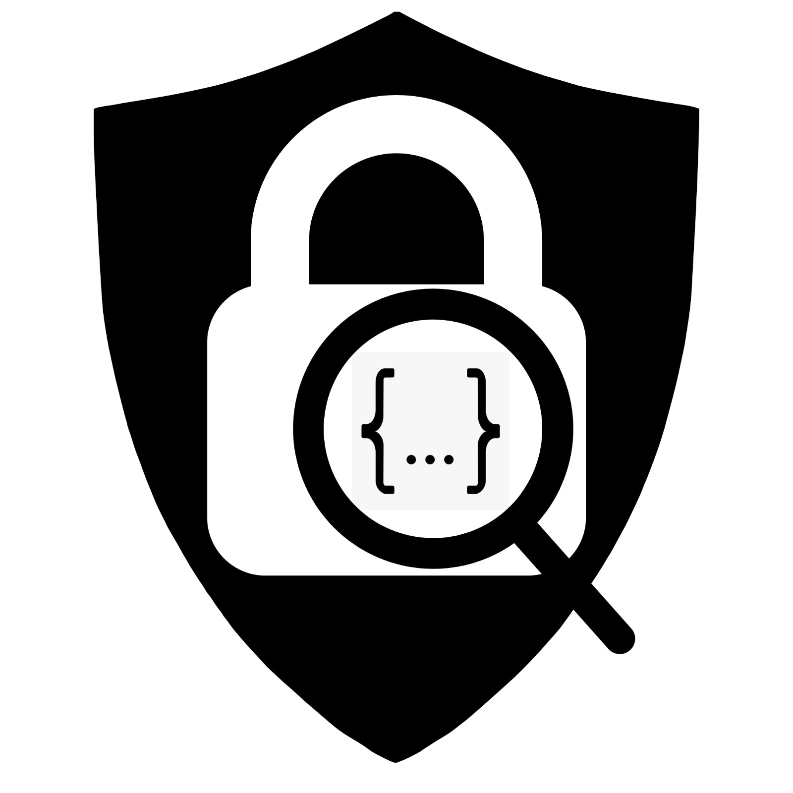

# RESTGuardian 

## Description

RESTGuardian is a personal data and sensitive data controller system in REST API responses. This repository contains all the necessary files and documentation related to the project.

## Features

- Feature 1: [Description of feature 1]
- Feature 2: [Description of feature 2]
- Feature 3: [Description of feature 3]
- ...

## Installation

1. Clone the repository using the command: `git clone ...`
2. Run the docker-compose using the command: `docker-compose up -d`
3. Alternative install. Access the dockerhub.com, copy the docker-compose file, create a docker-compose file in some folder and execute the command: `docker-compose up -d` this will download the image and create the container

## Usage

1. Start the application: `npm start`
2. Open your web browser and navigate to `http://localhost:3000` to access the application.

## Configuration

[Describe any configuration steps or environment variables required for the project.]

## Contributing

Contributions are welcome! Please follow these steps to contribute:

1. Fork the repository.
2. Create a new branch: `git checkout -b my-feature-branch`
3. Make your changes and commit them: `git commit -am 'Add new feature'`
4. Push to the branch: `git push origin my-feature-branch`
5. Submit a pull request.

## License

This project is licensed under the [License Name] - see the [LICENSE](LICENSE) file for details.

## Contact

For any inquiries or suggestions, please reach out to [email address].

## Acknowledgments

[List any acknowledgments or references you want to include.]

---

Feel free to customize this README template according to your project's needs. Good luck and happy coding!

